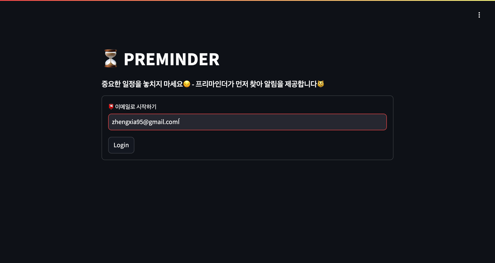
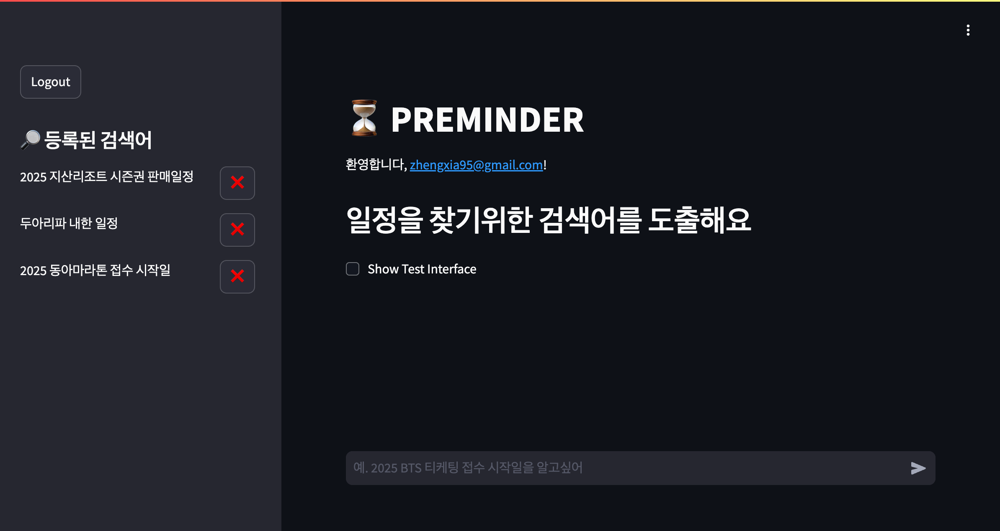
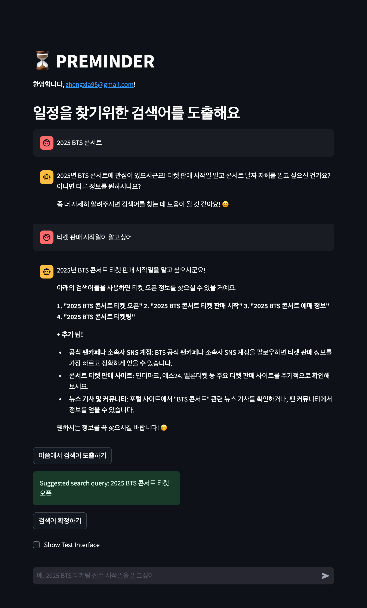

# Preminder


[사용해보기:Preminder](http://222.236.129.156:8501/)

Preminder는 중요한 이벤트의 날짜를 놓치지 않도록 도와주는 리마인더 서비스입니다. 콘서트 티켓 오픈, 시즌권 판매 일정 등 정확한 날짜를 모르는 이벤트를 추적하고, 일정이 확정되면 사용자에게 알림을 보냅니다.

## 주요 기능

- 이메일을 통한 간편한 로그인
- AI 기반 챗봇을 통한 이벤트 등록
- 자동 검색 쿼리 생성
- 일일 자동 검색 통한 신규 일정 확인 및 알림
- 등록된 이벤트 관리

## 사용 방법

### 1. 로그인



- 서비스에 접속하면 위와 같은 로그인 화면이 나타납니다.
- 이메일 주소를 입력하고 'Login' 버튼을 클릭하여 로그인합니다.

### 2. 메인 화면



- 로그인 후 메인 화면에서는 등록된 이벤트 목록과 새 이벤트 등록 인터페이스를 볼 수 있습니다.
- 왼쪽 사이드바에 등록된 이벤트 목록이 표시됩니다.
- 'Logout' 버튼을 통해 로그아웃할 수 있습니다.

### 3. 새 이벤트 등록



- "일정을 찾기위한 검색어를 도출해요" 입력창에 원하는 이벤트를 입력합니다.
- AI 챗봇이 대화를 통해 최적의 검색어를 도출합니다.
- 대화가 완료되면 "이쯤에서 검색어 도출하기" 버튼을 클릭합니다.
- 제안된 검색어를 확인하고 "검색어 확정하기" 버튼을 클릭하여 이벤트를 등록합니다.

### 4. 이벤트 알림

- 등록된 검색어는 일 단위로 구글 검색 API를 통해 검색됩니다.
- 상위 3개 검색 결과에 유의미한 결과가 존재하는지 Gemini를 통해 확인합니다.
- 유의미한 결과가 존재한다면 사용자에게 이메일 알림을 보냅니다.

### 5. 이벤트 관리

- 등록된 이벤트는 왼쪽 사이드바의 목록에서 확인할 수 있습니다.
- 각 이벤트 옆의 ❌ 버튼을 클릭하여 해당 이벤트를 삭제할 수 있습니다.

## 기술 스택

- Frontend: Streamlit
- Backend: FastAPI
- Database: SQLite
- AI: Google Gemini API

## 프로젝트 구조
    ```
    PREMINDER/
    │
    ├── app/
    │   ├── __init__.py
    │   ├── main.py (FastAPI 백엔드)
    │   ├── app.py (Streamlit 프론트엔드)
    │   └── config.py
    │
    ├── database/
    │   └── preminder.db
    │
    ├── static/
    │   └── images/
    │       ├── logo.png
    │       ├── login_screen.png
    │       ├── main_screen.png
    │       └── event_registration.png
    │
    ├── .env
    ├── .gitignore
    ├── requirements.txt
    ├── README.md
    └── run.py
    ```

## 설치 및 실행 방법

1. 저장소 클론:
    ```bash
    git clone https://github.com/yourusername/preminder.git
    cd preminder
    ```
2. 가상 환경 생성 및 활성화:
    ```bash
    python -m venv venv
    source venv/bin/activate  # Windows에서는 venv\Scripts\activate
    ```
3. 의존성 설치:
    ```bash
    pip install -r requirements.txt
    ```
4. 환경 변수 설정: `.env` 파일을 프로젝트 루트 디렉토리에 생성하고 다음 변수들을 설정하세요:
    ```bash
    GEMINI_API_KEY=your_gemini_api_key
    GOOGLE_API_KEY=your_google_api_key
    GOOGLE_CSE_ID=your_google_cse_id
    SENDER_EMAIL=your_sender_email
    EMAIL_PASSWORD=your_email_password
    ```

5. 애플리케이션 실행:
    ```bash
    python run.py
    ```

6. 브라우저에서 접속:
- FastAPI 백엔드: http://localhost:8000
- Streamlit 프론트엔드: http://localhost:8501

## To Do

- [ ] 서비스/이메일 도메인 구매 및 연계
- [ ] 로그인 과정에 Oauth 적용
- [ ] 일정을 찾으면 Google Task / Apple Reminder에 자동 등록
- [ ] 카카오톡 등 채팅 인터페이스에서 검색어 등록 및 알림 확인

## 기여 방법

1. 이 저장소를 포크합니다.
2. 새 브랜치를 생성합니다 (`git checkout -b feature/AmazingFeature`).
3. 변경 사항을 커밋합니다 (`git commit -m 'Add some AmazingFeature'`).
4. 브랜치에 푸시합니다 (`git push origin feature/AmazingFeature`).
5. Pull Request를 생성합니다.

## 라이선스

이 프로젝트는 MIT 라이선스 하에 배포됩니다. 자세한 내용은 [LICENSE](LICENSE) 파일을 참조하세요.

```txt
MIT License

Copyright (c) 2024 [Your Name]

Permission is hereby granted, free of charge, to any person obtaining a copy
of this software and associated documentation files (the "Software"), to deal
in the Software without restriction, including without limitation the rights
to use, copy, modify, merge, publish, distribute, sublicense, and/or sell
copies of the Software, and to permit persons to whom the Software is
furnished to do so, subject to the following conditions:

The above copyright notice and this permission notice shall be included in all
copies or substantial portions of the Software.

THE SOFTWARE IS PROVIDED "AS IS", WITHOUT WARRANTY OF ANY KIND, EXPRESS OR
IMPLIED, INCLUDING BUT NOT LIMITED TO THE WARRANTIES OF MERCHANTABILITY,
FITNESS FOR A PARTICULAR PURPOSE AND NONINFRINGEMENT. IN NO EVENT SHALL THE
AUTHORS OR COPYRIGHT HOLDERS BE LIABLE FOR ANY CLAIM, DAMAGES OR OTHER
LIABILITY, WHETHER IN AN ACTION OF CONTRACT, TORT OR OTHERWISE, ARISING FROM,
OUT OF OR IN CONNECTION WITH THE SOFTWARE OR THE USE OR OTHER DEALINGS IN THE
SOFTWARE.```